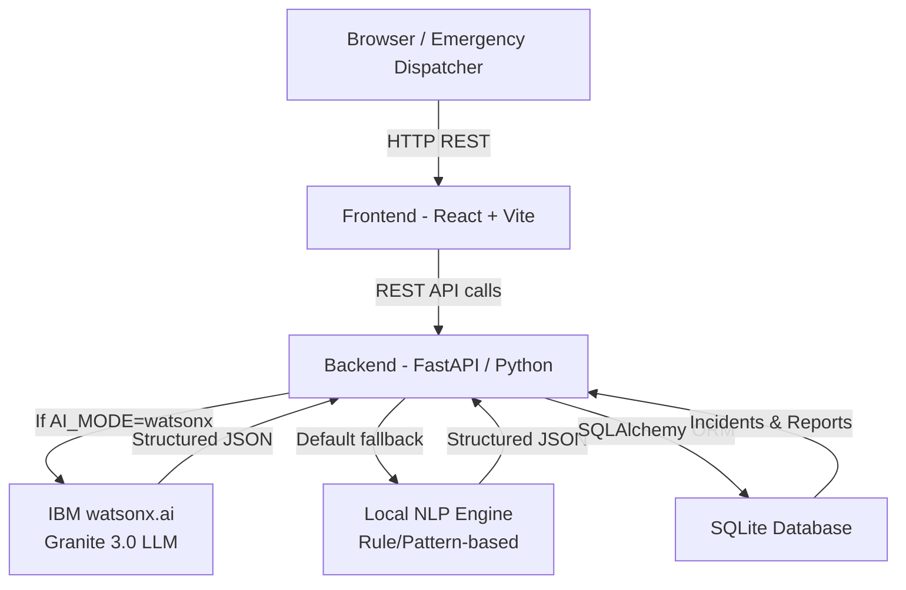

# Architecture — CrisisAI

## System Architecture

CrisisAI is a full-stack AI emergency operations platform composed of a React frontend, a FastAPI backend, and two inference modes: IBM watsonx.ai Granite (when configured) and a deterministic local NLP engine (default).



---

## Components

| Component | Technology | Responsibility |
|---|---|---|
| **Frontend** | React 19, Vite, Lucide React | Command-center dashboard, incident cards, tactical map, report submission modal, live stats |
| **Backend API** | FastAPI, Uvicorn, Python | REST endpoints, pipeline orchestration, AI routing, deduplication, priority scoring |
| **AI Extraction — Primary** | IBM watsonx.ai, Granite 3.0 | LLM-based structured information extraction when `AI_MODE=watsonx` and credentials are set |
| **AI Extraction — Fallback** | Local NLP (regex/rules) | Deterministic keyword/pattern-based extraction engine; no credentials required |
| **Similarity Engine** | scikit-learn TF-IDF, cosine similarity | TF-IDF N-gram vectorization + cosine similarity + entity corroboration for deduplication |
| **Priority Ranker** | Python (math.log2) | Multi-factor scoring: urgency base + category weight + human-risk bonus + log-corroboration |
| **Database** | SQLite, SQLAlchemy 2.0 | Persistent storage for incidents and reports |

---

## Data Flow

```
1.  Dispatcher or citizen submits raw emergency text via frontend or API
        POST /api/reports  {"text": "Water has entered railway station..."}

2.  Backend runs AI Information Extraction
        IBM Granite (if AI_MODE=watsonx) → structured JSON
        OR Local NLP engine (default)    → structured JSON
        Output: { incident_type, location, urgency, people_at_risk, people_count, category }

3.  Geocoding
        Extracted location string is resolved to lat/lng via configured landmark map

4.  TF-IDF N-gram Similarity & Deduplication
        Report text + extracted entities → TF-IDF (1,2)-gram vector
        Compared against all active incident representative vectors via cosine similarity
        Entity corroboration bonuses applied for matching location/type

5.  Decision
        composite_score >= 0.55 AND (location OR type match)
            → Merge into existing incident (report_count += 1, urgency escalated if needed)
        composite_score < 0.55
            → Create new incident

6.  Evidence Synthesis
        All merged report texts scanned for signal keywords (trapped, rising water, smoke, etc.)
        Corroborating bullet points generated
        Recommended dispatcher action determined

7.  Priority Scoring
        score = urgency_base + category_weight + human_risk_bonus + log2(report_count+1) × 60

8.  Frontend Dashboard
        Incidents sorted by priority_score descending
        Command center displays incident cards, tactical map, AI evidence, recommended action
```

---

## AI / ML Pipeline Detail

### Inference Modes

| Mode | Trigger | Technology | Description |
|---|---|---|---|
| **watsonx** | `AI_MODE=watsonx` + valid credentials | IBM Granite 3.0 via watsonx.ai REST API | LLM prompted to extract structured JSON from free-text report |
| **local** | Default / fallback | Deterministic regex + keyword rules | Pattern-matching extraction with hand-tuned rules for 18 known incident categories |

> These two modes are **not equivalent** in language generalization capability. IBM Granite handles novel phrasing; the local engine provides reliable, deterministic behavior for the demonstration dataset.

### Deduplication Algorithm

```
report_repr = report_text + " " + extracted_location + " " + incident_type

For each active incident:
    incident_repr = incident.title + incident.location + incident.type + last_5_report_texts

    text_similarity = cosine_similarity(
        TfidfVectorizer(ngram_range=(1,2)).fit_transform([report_repr, incident_repr])
    )

    if location_match AND type_match:  composite = max(text_sim, 0.75 + text_sim * 0.25)
    elif location_match:               composite = max(text_sim, 0.50 + text_sim * 0.40)
    elif type_match:                   composite = max(text_sim, 0.40 + text_sim * 0.40)
    else:                              composite = text_sim

If max(composite) >= SIMILARITY_THRESHOLD (0.55):
    → Merge into best-matching incident
Else:
    → Create new incident
```

### Priority Score Formula

```
Priority Score =
    Urgency Base          (CRITICAL=1000, HIGH=500, MEDIUM=200, LOW=50)
  + Category Weight       (Rescue=150, Fire=120, Hazard=100, Infrastructure=50)
  + Human Risk Bonus      (people_at_risk=350, +30 per affected person up to 10)
  + log2(report_count+1) × 60   (logarithmic corroboration factor)
```

---

## Security

- IBM Cloud credentials loaded exclusively from environment variables; never hardcoded.
- `.env` file is covered by `.gitignore` and excluded from all commits.
- `.env.example` contains placeholder values only.
- SQLite database files (`.db`, `.sqlite`) are excluded from Git tracking.
- The demonstration dataset uses synthetic emergency scenarios with no real PII.
- CORS is configured via `CORS_ORIGINS` environment variable.

---

## Scalability Notes

This is a prototype. For production scale:

- Replace SQLite with PostgreSQL or another production RDBMS.
- Replace per-request TF-IDF vectorization with a persistent vector index (e.g., FAISS, pgvector).
- The FastAPI backend is stateless and can be horizontally scaled behind a load balancer.
- IBM Granite calls are the primary external latency source; request batching reduces cost.
